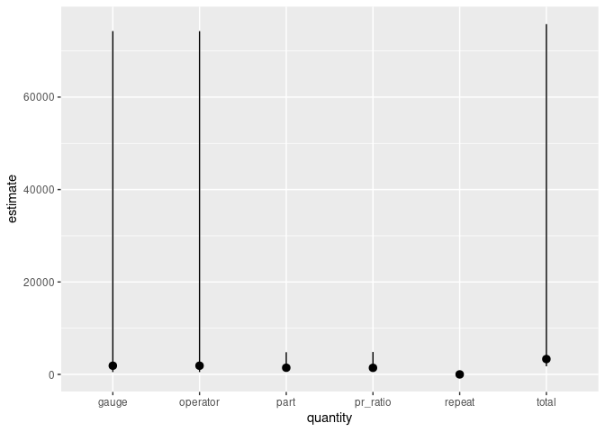

<!-- README.md is generated from README.Rmd. Please edit that file -->

# gaugerr

<!-- badges: start -->

[](https://github.com/aloy/gaugerr/actions/workflows/R-CMD-check.yaml)
<!-- badges: end -->

## Overview

gaugerr is a package that uses common models to implement Gauge R&R
analysis. This package was developed in the tidymodels framework. The
user provides the data for the analysis and the choses the function to
determine the type of input desired.

## Installation

You can install the development version of gaugerr using the code below:

``` r
install.packages("devtools")
devtools::install_github("aloy/gaugerr")
```

## Usage

There are several ways to use this package as it has different functions
depending on the calculations of interest. One highlight function of the
package is `gauge_rr()`. When a data set and specific parameters (part,
operator, measurement, interaction, factor1 and factor2) are passed into
the function, and it decides the type of analysis needed given the
information.

``` r
library(gaugerr)
gauge_rr(data1, P, O, Y, interaction=FALSE)
#>   quantity  estimate       lower        upper
#> 1   repeat    1.0151    0.759019     1.427511
#> 2     part 1441.0541  681.726616  4803.081613
#> 3 operator 1880.5966  509.776251 74280.900152
#> 4    total 3322.6658 1755.591276 75800.989157
#> 5    gauge 1881.6117  510.792004 74281.916368
#> 6 pr_ratio 1419.6182  622.082051  4859.528589
```

The table above gives information about the point estimator of the
quantity and the upper and lower bounds for the confidence intervals.
This function will always return an object with these same columns and
the object can be plotted to show these values visually.

The figure below plots the information from the table of values. The
points are the values of point estimators and the line segments show the
range for the upper and lower bounds of the confidence interval.



## Learning

This package is intended to be very user friendly for individuals
wanting to run Gauge R&R analysis. There are specific functions for
particular calculations of interest and there are general functions that
provide more of an overview.
